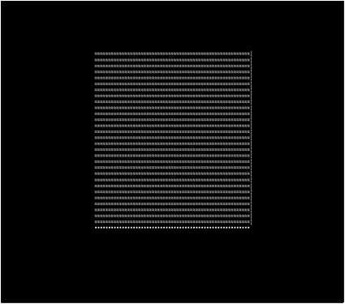

# WinUI - Rotating Cube

## v1.0.0.0 - September 2024

**Dependencies**

| Assembly | Version |
| ---- | ---- |
| NET Core | 8.0 |

- A cube rotation demonstration using text characters.
- A [TextBox](https://learn.microsoft.com/en-us/uwp/api/windows.ui.xaml.controls.textbox?view=winrt-26100) control is used to host the frame animations.

